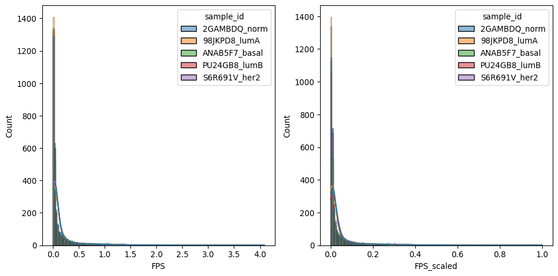

# Pan-Cancer TF Footprinting & Noncoding Mutation Data Integration
Suffian Azizan

*Note: This is a Github README doc that is dynamically generated from
the `qmd` notebook.*

# Background

This pan-cancer study makes use of restricted ATAC-seq and DNAse-seq
datasets generated from healthy and cancerous human tissue samplles
available in the public databases (i.e. TCGA and BLUEPRINT) to generate
TF footprinting data from the open chromatin regions. The TF
footprinting data is then combined with the noncoding mutation data from
the same samples obtained via variant calling to identify TF binding
sites (TFBS) that carry variant alleles (or potentially mutations) that
may modulate TF footprint scores (proxy for TF binding activity).

# Data Preprocessing

TF footprints are determined and scored using the
[TOBIAS](https://github.molgen.mpg.de/pages/loosolab/www/software/TOBIAS/)
program published by Looso Lab (Max Plank Institute). A customized
TOBIAS pipeline was run on individual samples so TOBIAS’s internal
intersample normalization was not applied. The raw footprint scores were
collated for all samples in this pan-cancer study and combined into a
large dense matrix containing unique footprint sites of a particular
motif of interest across all samples. As we have 1360 motifs of interest
in this study, we have 1360 large data tables to process.

For the purpose of demonstration, a subset of TF footprint data of the
open chromatin regions in only breast cancer samples from TCGA database
was used here to save storage space and lower processing overhead.
Additionally, only 1 TF motif will be presented here in the analysis
workflow.

First, load up required Python packages.

``` python
import os
import textwrap
import pandas as pd
import seaborn as sns
import statsmodels.api as sm
import matplotlib.pyplot as plt
from natsort import index_natsorted
```

## Loading up the footprint data table

Now, we can import the data tables as Pandas dataframes. The data are
stored in tab-delimited text files (`.tsv`). The first column defines
the chromosomal location, the second and third column contain the
genomic coordinates of the TF footprint, the fourth column retains the
strandedness of the TF binding site (TFBS), the fifth column contains
the TFBS score (similarity score with the tested motif PWM), and the
rest of the columns carry the actual TOBIAS-calculated TF footprint
scores for individual samples.

The data is loaded into a Pandas dataframe and the first 5 rows are
displayed.

``` python
# import the data
filepath = '../demo-data/E2F2_E2F2_HUMAN.H11MO.0.B_BRCA-subtype-vcf-filtered-matrix.txt'
df_fpscore = pd.read_csv(filepath, sep='\t')
```

**Aside**: specify a formatter function to wrap long text in the data
tables.

``` python
#replace underscore with whitespace
func_underscore_replace = lambda x: x.replace("_", " ")
#wrap text
def func_wrap(x):
    if isinstance(x, str):
        return textwrap.fill(x, width=10)
    else:
        return x
```

<div>
<style scoped>
    .dataframe tbody tr th:only-of-type {
        vertical-align: middle;
    }
&#10;    .dataframe tbody tr th {
        vertical-align: top;
    }
&#10;    .dataframe thead th {
        text-align: right;
    }
</style>

|     | TFBS_chr | TFBS_start | TFBS_end | TFBS_strand | TFBS_score | 98JKPD8_LumA_score | ANAB5F7_Basal_score | S6R691V_Her2_score | PU24GB8_LumB_score | 2GAMBDQ_Normal-like_score |
|-----|----------|------------|----------|-------------|------------|--------------------|---------------------|--------------------|--------------------|---------------------------|
| 0   | chr1     | 10628      | 10638    | \+          | 7.40189    | 0.0000             | 0.00000             | 0.00000            | 0.000              | 0.0000                    |
| 1   | chr1     | 181224     | 181234   | \+          | 7.99866    | 0.0000             | 0.00000             | 0.00000            | 0.000              | 0.0000                    |
| 2   | chr1     | 779214     | 779224   | \-          | 7.79647    | 0.0000             | 0.00000             | 0.00000            | 0.000              | 0.0000                    |
| 3   | chr1     | 998754     | 998764   | \+          | 8.56029    | 0.1376             | 0.14035             | 0.12842            | 0.145              | 0.1051                    |

</div>

Rename the `_score` column to `_fps` to avoid confusion with the
mutation score column in the mutation data table later, and drop the
`TFBS_strand` and `TFBS_score` columns as they are not needed for now.

``` python
# drop the column "TFBS_strand" and "TFBS_score"
df_fpscore = df_fpscore.drop(columns=["TFBS_strand", "TFBS_score"])
# rename columns in the dataframe
df_fpscore = df_fpscore.rename(columns={"TFBS_chr": "Chromosome", "TFBS_start": "Start", "TFBS_end": "End", "2GAMBDQ_Normal-like_score": "2GAMBDQ_Norm_fps"})
# for all column names that end with the string 'score', replace the string with 'fps'
df_fpscore = df_fpscore.rename(columns=lambda x: x.replace('score', 'fps') if x.endswith('score') else x)
```

<style type="text/css">
#T_571c5_row0_col0, #T_571c5_row0_col1, #T_571c5_row0_col2, #T_571c5_row0_col3, #T_571c5_row0_col4, #T_571c5_row0_col5, #T_571c5_row0_col6, #T_571c5_row0_col7, #T_571c5_row1_col0, #T_571c5_row1_col1, #T_571c5_row1_col2, #T_571c5_row1_col3, #T_571c5_row1_col4, #T_571c5_row1_col5, #T_571c5_row1_col6, #T_571c5_row1_col7, #T_571c5_row2_col0, #T_571c5_row2_col1, #T_571c5_row2_col2, #T_571c5_row2_col3, #T_571c5_row2_col4, #T_571c5_row2_col5, #T_571c5_row2_col6, #T_571c5_row2_col7, #T_571c5_row3_col0, #T_571c5_row3_col1, #T_571c5_row3_col2, #T_571c5_row3_col3, #T_571c5_row3_col4, #T_571c5_row3_col5, #T_571c5_row3_col6, #T_571c5_row3_col7, #T_571c5_row4_col0, #T_571c5_row4_col1, #T_571c5_row4_col2, #T_571c5_row4_col3, #T_571c5_row4_col4, #T_571c5_row4_col5, #T_571c5_row4_col6, #T_571c5_row4_col7, #T_571c5_row5_col0, #T_571c5_row5_col1, #T_571c5_row5_col2, #T_571c5_row5_col3, #T_571c5_row5_col4, #T_571c5_row5_col5, #T_571c5_row5_col6, #T_571c5_row5_col7, #T_571c5_row6_col0, #T_571c5_row6_col1, #T_571c5_row6_col2, #T_571c5_row6_col3, #T_571c5_row6_col4, #T_571c5_row6_col5, #T_571c5_row6_col6, #T_571c5_row6_col7, #T_571c5_row7_col0, #T_571c5_row7_col1, #T_571c5_row7_col2, #T_571c5_row7_col3, #T_571c5_row7_col4, #T_571c5_row7_col5, #T_571c5_row7_col6, #T_571c5_row7_col7, #T_571c5_row8_col0, #T_571c5_row8_col1, #T_571c5_row8_col2, #T_571c5_row8_col3, #T_571c5_row8_col4, #T_571c5_row8_col5, #T_571c5_row8_col6, #T_571c5_row8_col7, #T_571c5_row9_col0, #T_571c5_row9_col1, #T_571c5_row9_col2, #T_571c5_row9_col3, #T_571c5_row9_col4, #T_571c5_row9_col5, #T_571c5_row9_col6, #T_571c5_row9_col7 {
  font-size: 10pt;
}
</style>

|     | Chromosome | Start   | End     | 98JKPD8_LumA_fps | ANAB5F7_Basal_fps | S6R691V_Her2_fps | PU24GB8_LumB_fps | 2GAMBDQ_Norm_fps |
|-----|------------|---------|---------|------------------|-------------------|------------------|------------------|------------------|
| 0   | chr1       | 10628   | 10638   | 0.000000         | 0.000000          | 0.000000         | 0.000000         | 0.000000         |
| 1   | chr1       | 181224  | 181234  | 0.000000         | 0.000000          | 0.000000         | 0.000000         | 0.000000         |
| 2   | chr1       | 779214  | 779224  | 0.000000         | 0.000000          | 0.000000         | 0.000000         | 0.000000         |
| 3   | chr1       | 998754  | 998764  | 0.137600         | 0.140350          | 0.128420         | 0.145000         | 0.105100         |
| 4   | chr1       | 998768  | 998778  | 0.182240         | 0.167080          | 0.169110         | 0.183020         | 0.127590         |
| 5   | chr1       | 1019693 | 1019703 | 0.622590         | 0.379450          | 0.489290         | 0.644200         | 0.492220         |
| 6   | chr1       | 1041096 | 1041106 | 0.096050         | 0.097560          | 0.090640         | 0.127590         | 0.110160         |
| 7   | chr1       | 1164827 | 1164837 | 0.110270         | 0.149950          | 0.073960         | 0.067850         | 0.080790         |
| 8   | chr1       | 1206766 | 1206776 | 0.067360         | 0.063970          | 0.041980         | 0.069200         | 0.072820         |
| 9   | chr1       | 1309989 | 1309999 | 0.123050         | 0.144050          | 0.141260         | 0.124540         | 0.096460         |

## Loading up the mutation data table

This mutation data is generated from the output of `bcftools` variant
calling pipeline. First, load up an example data file to see how the
data is structured.

``` python
vcfpath = '../demo-data/2GAMBDQ_E2F2_E2F2_HUMAN.H11MO.0.B_AF-per-site-with-indels.txt'
# load up the vcf file with indels and multiallelic sites split into separate rows
df_vcf = pd.read_csv(vcfpath, sep="\t")
```

<style type="text/css">
#T_c7aeb_row0_col0, #T_c7aeb_row0_col1, #T_c7aeb_row0_col2, #T_c7aeb_row0_col3, #T_c7aeb_row0_col4, #T_c7aeb_row1_col0, #T_c7aeb_row1_col1, #T_c7aeb_row1_col2, #T_c7aeb_row1_col3, #T_c7aeb_row1_col4, #T_c7aeb_row2_col0, #T_c7aeb_row2_col1, #T_c7aeb_row2_col2, #T_c7aeb_row2_col3, #T_c7aeb_row2_col4, #T_c7aeb_row3_col0, #T_c7aeb_row3_col1, #T_c7aeb_row3_col2, #T_c7aeb_row3_col3, #T_c7aeb_row3_col4, #T_c7aeb_row4_col0, #T_c7aeb_row4_col1, #T_c7aeb_row4_col2, #T_c7aeb_row4_col3, #T_c7aeb_row4_col4 {
  font-size: 10pt;
}
</style>

| \#\[1\]CHROM | \[2\]POS | \[3\]REF                            | \[4\]ALT                | \[5\]AF |
|--------------|----------|-------------------------------------|-------------------------|---------|
| chr1         | 10629    | GGCGCGC                             | GGCGC                   | 1.0     |
| chr1         | 998764   | C                                   | G                       | 0.5     |
| chr1         | 998764   | CGGAGGG                             | CGGAGGGGAG GG           | 0.3125  |
| chr1         | 1041101  | CGGAGCGGGG CGGGAGCGGG GCGGGAGCGG GG | CGGAGCGGGG CGGGAGCGGG G | 0.5     |
| chr1         | 1164837  | C                                   | T                       | 0.8125  |

The file above corresponds to just one of the sample IDs in this
pan-cancer study. To load up all the mutation data for all samples, we
need to load up all the files in the directory. Let’s put the dataframes
in one dictionary object using a loop.

``` python
# create a vcf load function for the query vcfs
def load_vcf(vcf_path):
    # load up the vcf file with indels and multiallelic sites split into separate rows
    df_vcf = pd.read_csv(vcf_path, sep="\t")
    # rename columns in the dataframe
    df_vcf = df_vcf.rename(columns={"#[1]CHROM": "Chromosome", "[2]POS": "Start", "[3]REF": "ref_allele", "[4]ALT": "alt_allele", "[5]AF": "AF"})
    # add a column next to the "start" column called "end" with the same value as the "start" column
    df_vcf.insert(2, "End", df_vcf["Start"])
    return df_vcf

# now put the paths in a list
paths = [
    "../demo-data/2GAMBDQ_E2F2_E2F2_HUMAN.H11MO.0.B_AF-per-site-with-indels.txt",
    "../demo-data/98JKPD8_E2F2_E2F2_HUMAN.H11MO.0.B_AF-per-site-with-indels.txt",
    "../demo-data/ANAB5F7_E2F2_E2F2_HUMAN.H11MO.0.B_AF-per-site-with-indels.txt",
    "../demo-data/PU24GB8_E2F2_E2F2_HUMAN.H11MO.0.B_AF-per-site-with-indels.txt",
    "../demo-data/S6R691V_E2F2_E2F2_HUMAN.H11MO.0.B_AF-per-site-with-indels.txt"
]

# create a list of IDs
ids = [ "ANAB5F7_basal", "98JKPD8_lumA", "PU24GB8_lumB", "S6R691V_her2", "2GAMBDQ_norm"]

# create a pair dictionary using nested dict comprehension
# for each id in the list of ids, iterate through the list of paths and check if the id is in the path; this means there is no need to order the list of ids according to the order of the paths

path_id_dict = {id: load_vcf(path) for id in ids for path in paths if id.split("_")[0] in path}
```

## Using PyRanges for dataframe merging

As we are dealing with genomic regions where the data is related to
interval values (start and end coordinates) spanning across two columns,
it is not possible to do dataframe overlap or join using Pandas. We will
need to use a specialized Python package called [PyRanges]() to handle
genomic coordinates.

Import the package and then first convert the footprint dataframe into a
PyRanges object.

``` python
import pyranges as pr

gr_fpscore = pr.PyRanges(df_fpscore)
```

<style type="text/css">
#T_11f8c th {
  font-size: 8pt;
}
#T_11f8c_row0_col0, #T_11f8c_row0_col1, #T_11f8c_row0_col2, #T_11f8c_row0_col3, #T_11f8c_row0_col4, #T_11f8c_row0_col5, #T_11f8c_row0_col6, #T_11f8c_row0_col7, #T_11f8c_row1_col0, #T_11f8c_row1_col1, #T_11f8c_row1_col2, #T_11f8c_row1_col3, #T_11f8c_row1_col4, #T_11f8c_row1_col5, #T_11f8c_row1_col6, #T_11f8c_row1_col7, #T_11f8c_row2_col0, #T_11f8c_row2_col1, #T_11f8c_row2_col2, #T_11f8c_row2_col3, #T_11f8c_row2_col4, #T_11f8c_row2_col5, #T_11f8c_row2_col6, #T_11f8c_row2_col7, #T_11f8c_row3_col0, #T_11f8c_row3_col1, #T_11f8c_row3_col2, #T_11f8c_row3_col3, #T_11f8c_row3_col4, #T_11f8c_row3_col5, #T_11f8c_row3_col6, #T_11f8c_row3_col7, #T_11f8c_row4_col0, #T_11f8c_row4_col1, #T_11f8c_row4_col2, #T_11f8c_row4_col3, #T_11f8c_row4_col4, #T_11f8c_row4_col5, #T_11f8c_row4_col6, #T_11f8c_row4_col7 {
  font-size: 10pt;
}
</style>

| Chromosome | Start  | End    | 98JKPD8 LumA fps | ANAB5F7 Basal fps | S6R691V Her2 fps | PU24GB8 LumB fps | 2GAMBDQ Norm fps |
|------------|--------|--------|------------------|-------------------|------------------|------------------|------------------|
| chr1       | 10628  | 10638  | 0.0              | 0.0               | 0.0              | 0.0              | 0.0              |
| chr1       | 181224 | 181234 | 0.0              | 0.0               | 0.0              | 0.0              | 0.0              |
| chr1       | 779214 | 779224 | 0.0              | 0.0               | 0.0              | 0.0              | 0.0              |
| chr1       | 998754 | 998764 | 0.1376           | 0.14035           | 0.12842          | 0.145            | 0.1051           |
| chr1       | 998768 | 998778 | 0.18224          | 0.16708           | 0.16911          | 0.18302          | 0.12759          |

Do the same for the mutation dataframes in the dictionary. Loop through
it and save them in a new dictionary.

``` python
# load up vcf_dfs into pyranges 
grs = {}
for name,vcf in path_id_dict.items():
    gr_vcf = pr.PyRanges(vcf)
    grs[name] = gr_vcf

print(grs["ANAB5F7_basal"].head(n=10))
```

    +--------------+-----------+-----------+-------+
    | Chromosome   | Start     | End       | +3    |
    | (category)   | (int64)   | (int64)   | ...   |
    |--------------+-----------+-----------+-------|
    | chr1         | 10629     | 10629     | ...   |
    | chr1         | 181234    | 181234    | ...   |
    | chr1         | 779216    | 779216    | ...   |
    | chr1         | 998764    | 998764    | ...   |
    | ...          | ...       | ...       | ...   |
    | chr1         | 1019700   | 1019700   | ...   |
    | chr1         | 1041101   | 1041101   | ...   |
    | chr1         | 1164837   | 1164837   | ...   |
    | chr1         | 1206770   | 1206770   | ...   |
    +--------------+-----------+-----------+-------+
    Unstranded PyRanges object has 10 rows and 6 columns from 1 chromosomes.
    For printing, the PyRanges was sorted on Chromosome.
    3 hidden columns: ref_allele, alt_allele, AF

## Merging the PyRanges objects

Now, we can merge the PyRanges objects using the `join` function. The
`how` argument is set to `left` to retain all the rows in the left
dataframe (i.e. the footprint dataframe) and the `suffix` argument is
set to `_[sample ID]_varsite_pos` to add a suffix to the columns in the
right dataframe (i.e. the mutation dataframe) to avoid column name
clashes.

``` python
count = 0
for key, val in grs.items():
    
    if count == 0:
        overlap = gr_fpscore.join(val, how='left', suffix=f"_{key}_varsite_pos", preserve_order = True)
    else:
        overlap = filtered_gr.join(val, how='left', suffix=f"_{key}_varsite_pos", preserve_order = True)
    
    # drop the column "End" column
    overlap = overlap.drop([f"End_{key}_varsite_pos"])

    # cluster the pyRanges object by genomic range; overlapping regions wil share the same id. This will add a new column called "Cluster"
    overlap = overlap.cluster(slack=-1)

    # cast back into a dataframe and filter by the AF column's max value (by Cluster); this returns a filtered dataframe
    filtered_df = overlap.df.loc[overlap.df.groupby('Cluster')['AF'].idxmax()]
    
    # cast back into a dataframe and rename metadata columns
    filtered_df = filtered_df.rename(columns={f"Start_{key}_varsite_pos": f"{key}_varsite_pos", "ref_allele": f"{key}_REF", "alt_allele": f"{key}_ALT", "AF": f"{key}_AF"})
    
    # replace all the -1 values in column 'Start_varsites', 'ref_allele' and 'alt_allele', and AF with 0
    # Define a dictionary mapping column names to values to replace
    replace_dict = {f"{key}_varsite_pos": {-1: None}, f"{key}_REF": {str(-1): None}, f"{key}_ALT": {str(-1): None}, f"{key}_AF": {-1: 0}}
    filtered_df = filtered_df.replace(replace_dict)

    # drop cluster column
    filtered_df = filtered_df.drop(columns=["Cluster"])

    # cast back into pyrange object
    filtered_gr = pr.PyRanges(filtered_df)

    # increment count
    count += 1
```

Note that during the overlap process, the use of `cluster` function is
to ensure that overlapping regions will share the same ID. This is
important as we will need to filter the overlapping regions by the
maximum allele frequency (AF) value so that only 1) unique chromosome
regions are returned, and 2) regions with multiallelic sites, only the
site with the highest AF value is returned.

Now, we can clean up the PyRanges object and convert it back to a Pandas
dataframe. This file will be the basis for all downstream analyses.

``` python
final_df = filtered_gr.df

# create a column called 'region_id'
final_df["region_id"] = final_df["Chromosome"].astype(str) + ":" + final_df["Start"].astype(str) + "-" + final_df["End"].astype(str)

# for all column name ending with the string '_fps', split the string, take the second element, change the first letter in the string to lowercase, and reconstruct the original string with the new first letter
final_df = final_df.rename(columns=lambda x: x.split('_')[0] + '_' + x.split('_')[1][0].lower() + x.split('_')[1][1:] + '_fps' if x.endswith('_fps') else x)
```

A slice of the final dataframe is shown below.

<style type="text/css">
#T_93dfd th {
  font-size: 8pt;
}
#T_93dfd_row0_col0, #T_93dfd_row0_col1, #T_93dfd_row0_col2, #T_93dfd_row0_col3, #T_93dfd_row0_col4, #T_93dfd_row0_col5, #T_93dfd_row0_col6, #T_93dfd_row0_col7, #T_93dfd_row0_col8, #T_93dfd_row0_col9, #T_93dfd_row0_col10, #T_93dfd_row0_col11, #T_93dfd_row0_col12, #T_93dfd_row0_col13, #T_93dfd_row0_col14, #T_93dfd_row0_col15, #T_93dfd_row0_col16, #T_93dfd_row0_col17, #T_93dfd_row0_col18, #T_93dfd_row0_col19, #T_93dfd_row0_col20, #T_93dfd_row0_col21, #T_93dfd_row0_col22, #T_93dfd_row0_col23, #T_93dfd_row0_col24, #T_93dfd_row0_col25, #T_93dfd_row0_col26, #T_93dfd_row0_col27, #T_93dfd_row0_col28, #T_93dfd_row1_col0, #T_93dfd_row1_col1, #T_93dfd_row1_col2, #T_93dfd_row1_col3, #T_93dfd_row1_col4, #T_93dfd_row1_col5, #T_93dfd_row1_col6, #T_93dfd_row1_col7, #T_93dfd_row1_col8, #T_93dfd_row1_col9, #T_93dfd_row1_col10, #T_93dfd_row1_col11, #T_93dfd_row1_col12, #T_93dfd_row1_col13, #T_93dfd_row1_col14, #T_93dfd_row1_col15, #T_93dfd_row1_col16, #T_93dfd_row1_col17, #T_93dfd_row1_col18, #T_93dfd_row1_col19, #T_93dfd_row1_col20, #T_93dfd_row1_col21, #T_93dfd_row1_col22, #T_93dfd_row1_col23, #T_93dfd_row1_col24, #T_93dfd_row1_col25, #T_93dfd_row1_col26, #T_93dfd_row1_col27, #T_93dfd_row1_col28, #T_93dfd_row2_col0, #T_93dfd_row2_col1, #T_93dfd_row2_col2, #T_93dfd_row2_col3, #T_93dfd_row2_col4, #T_93dfd_row2_col5, #T_93dfd_row2_col6, #T_93dfd_row2_col7, #T_93dfd_row2_col8, #T_93dfd_row2_col9, #T_93dfd_row2_col10, #T_93dfd_row2_col11, #T_93dfd_row2_col12, #T_93dfd_row2_col13, #T_93dfd_row2_col14, #T_93dfd_row2_col15, #T_93dfd_row2_col16, #T_93dfd_row2_col17, #T_93dfd_row2_col18, #T_93dfd_row2_col19, #T_93dfd_row2_col20, #T_93dfd_row2_col21, #T_93dfd_row2_col22, #T_93dfd_row2_col23, #T_93dfd_row2_col24, #T_93dfd_row2_col25, #T_93dfd_row2_col26, #T_93dfd_row2_col27, #T_93dfd_row2_col28, #T_93dfd_row3_col0, #T_93dfd_row3_col1, #T_93dfd_row3_col2, #T_93dfd_row3_col3, #T_93dfd_row3_col4, #T_93dfd_row3_col5, #T_93dfd_row3_col6, #T_93dfd_row3_col7, #T_93dfd_row3_col8, #T_93dfd_row3_col9, #T_93dfd_row3_col10, #T_93dfd_row3_col11, #T_93dfd_row3_col12, #T_93dfd_row3_col13, #T_93dfd_row3_col14, #T_93dfd_row3_col15, #T_93dfd_row3_col16, #T_93dfd_row3_col17, #T_93dfd_row3_col18, #T_93dfd_row3_col19, #T_93dfd_row3_col20, #T_93dfd_row3_col21, #T_93dfd_row3_col22, #T_93dfd_row3_col23, #T_93dfd_row3_col24, #T_93dfd_row3_col25, #T_93dfd_row3_col26, #T_93dfd_row3_col27, #T_93dfd_row3_col28, #T_93dfd_row4_col0, #T_93dfd_row4_col1, #T_93dfd_row4_col2, #T_93dfd_row4_col3, #T_93dfd_row4_col4, #T_93dfd_row4_col5, #T_93dfd_row4_col6, #T_93dfd_row4_col7, #T_93dfd_row4_col8, #T_93dfd_row4_col9, #T_93dfd_row4_col10, #T_93dfd_row4_col11, #T_93dfd_row4_col12, #T_93dfd_row4_col13, #T_93dfd_row4_col14, #T_93dfd_row4_col15, #T_93dfd_row4_col16, #T_93dfd_row4_col17, #T_93dfd_row4_col18, #T_93dfd_row4_col19, #T_93dfd_row4_col20, #T_93dfd_row4_col21, #T_93dfd_row4_col22, #T_93dfd_row4_col23, #T_93dfd_row4_col24, #T_93dfd_row4_col25, #T_93dfd_row4_col26, #T_93dfd_row4_col27, #T_93dfd_row4_col28 {
  font-size: 8pt;
}
</style>

|     | Chromosome | Start  | End    | 98JKPD8 lumA fps | ANAB5F7 basal fps | S6R691V her2 fps | PU24GB8 lumB fps | 2GAMBDQ norm fps | ANAB5F7 basal varsite pos | ANAB5F7 basal REF | ANAB5F7 basal ALT | ANAB5F7 basal AF | 98JKPD8 lumA varsite pos | 98JKPD8 lumA REF | 98JKPD8 lumA ALT | 98JKPD8 lumA AF | PU24GB8 lumB varsite pos | PU24GB8 lumB REF | PU24GB8 lumB ALT | PU24GB8 lumB AF | S6R691V her2 varsite pos | S6R691V her2 REF | S6R691V her2 ALT | S6R691V her2 AF | 2GAMBDQ norm varsite pos | 2GAMBDQ norm REF | 2GAMBDQ norm ALT | 2GAMBDQ norm AF | region id          |
|-----|------------|--------|--------|------------------|-------------------|------------------|------------------|------------------|---------------------------|-------------------|-------------------|------------------|--------------------------|------------------|------------------|-----------------|--------------------------|------------------|------------------|-----------------|--------------------------|------------------|------------------|-----------------|--------------------------|------------------|------------------|-----------------|--------------------|
| 0   | chr1       | 10628  | 10638  | 0.000000         | 0.000000          | 0.000000         | 0.000000         | 0.000000         | 10629                     | GGCGCGC           | GGCGC             | 1.000000         | 10629                    | GGCGCGC          | GGCGC            | 0.958333        | 10629                    | GGCGCGC          | GGCGC            | 1.000000        | 10629                    | GGCGCGC          | GGCGC            | 1.000000        | 10629                    | GGCGCGC          | GGCGC            | 1.000000        | chr1:10628-10638   |
| 1   | chr1       | 181224 | 181234 | 0.000000         | 0.000000          | 0.000000         | 0.000000         | 0.000000         | None                      | None              | None              | 0.000000         | None                     | None             | None             | 0.000000        | None                     | None             | None             | 0.000000        | None                     | None             | None             | 0.000000        | None                     | None             | None             | 0.000000        | chr1:181224-181234 |
| 2   | chr1       | 779214 | 779224 | 0.000000         | 0.000000          | 0.000000         | 0.000000         | 0.000000         | 779216                    | T                 | C                 | 0.029412         | 779216                   | T                | C                | 0.125000        | 779216                   | T                | C                | 0.026316        | 779216                   | T                | C                | 0.058824        | None                     | None             | None             | 0.000000        | chr1:779214-779224 |
| 3   | chr1       | 998754 | 998764 | 0.137600         | 0.140350          | 0.128420         | 0.145000         | 0.105100         | None                      | None              | None              | 0.000000         | None                     | None             | None             | 0.000000        | None                     | None             | None             | 0.000000        | None                     | None             | None             | 0.000000        | None                     | None             | None             | 0.000000        | chr1:998754-998764 |
| 4   | chr1       | 998768 | 998778 | 0.182240         | 0.167080          | 0.169110         | 0.183020         | 0.127590         | None                      | None              | None              | 0.000000         | None                     | None             | None             | 0.000000        | None                     | None             | None             | 0.000000        | None                     | None             | None             | 0.000000        | None                     | None             | None             | 0.000000        | chr1:998768-998778 |

The final dataframe here is saved as a tab-delimited text file in
`demo-data/` with the filename suffix
“`_fpscore-af-varsites-combined-matrix-wide.tsv`”.

# Merged Dataframe Data Analysis

Now that the data from the footprinting of TFs (**NOTE**: we are only
using E2F2 TF footprinting data here) and the mutation data overlapping
these footprints (obtained post-variant caling) are combined into a
single dataframe, we can start to do some analysis.

First load up the merged dataframe.

``` python
# import the data
filepath = '../demo-data/E2F2_E2F2_HUMAN.H11MO.0.B_fpscore-af-varsites-combined-matrix-wide.tsv'
afps_df = pd.read_csv(filepath, sep='\t')
# extract motif id from filename
motif_id = os.path.basename(filepath).replace('_fpscore-af-varsites-combined-matrix-wide.tsv', '')
print(f"The motif ID of the current TF data: {motif_id} \n")
```

    The motif ID of the current TF data: E2F2_E2F2_HUMAN.H11MO.0.B 

<style type="text/css">
#T_599fc_row0_col0, #T_599fc_row0_col1, #T_599fc_row0_col2, #T_599fc_row0_col3, #T_599fc_row0_col4, #T_599fc_row0_col5, #T_599fc_row0_col6, #T_599fc_row0_col7, #T_599fc_row0_col8, #T_599fc_row0_col9, #T_599fc_row0_col10, #T_599fc_row0_col11, #T_599fc_row0_col12, #T_599fc_row0_col13, #T_599fc_row0_col14, #T_599fc_row0_col15, #T_599fc_row0_col16, #T_599fc_row0_col17, #T_599fc_row0_col18, #T_599fc_row0_col19, #T_599fc_row0_col20, #T_599fc_row0_col21, #T_599fc_row0_col22, #T_599fc_row0_col23, #T_599fc_row0_col24, #T_599fc_row0_col25, #T_599fc_row0_col26, #T_599fc_row0_col27, #T_599fc_row0_col28, #T_599fc_row1_col0, #T_599fc_row1_col1, #T_599fc_row1_col2, #T_599fc_row1_col3, #T_599fc_row1_col4, #T_599fc_row1_col5, #T_599fc_row1_col6, #T_599fc_row1_col7, #T_599fc_row1_col8, #T_599fc_row1_col9, #T_599fc_row1_col10, #T_599fc_row1_col11, #T_599fc_row1_col12, #T_599fc_row1_col13, #T_599fc_row1_col14, #T_599fc_row1_col15, #T_599fc_row1_col16, #T_599fc_row1_col17, #T_599fc_row1_col18, #T_599fc_row1_col19, #T_599fc_row1_col20, #T_599fc_row1_col21, #T_599fc_row1_col22, #T_599fc_row1_col23, #T_599fc_row1_col24, #T_599fc_row1_col25, #T_599fc_row1_col26, #T_599fc_row1_col27, #T_599fc_row1_col28, #T_599fc_row2_col0, #T_599fc_row2_col1, #T_599fc_row2_col2, #T_599fc_row2_col3, #T_599fc_row2_col4, #T_599fc_row2_col5, #T_599fc_row2_col6, #T_599fc_row2_col7, #T_599fc_row2_col8, #T_599fc_row2_col9, #T_599fc_row2_col10, #T_599fc_row2_col11, #T_599fc_row2_col12, #T_599fc_row2_col13, #T_599fc_row2_col14, #T_599fc_row2_col15, #T_599fc_row2_col16, #T_599fc_row2_col17, #T_599fc_row2_col18, #T_599fc_row2_col19, #T_599fc_row2_col20, #T_599fc_row2_col21, #T_599fc_row2_col22, #T_599fc_row2_col23, #T_599fc_row2_col24, #T_599fc_row2_col25, #T_599fc_row2_col26, #T_599fc_row2_col27, #T_599fc_row2_col28, #T_599fc_row3_col0, #T_599fc_row3_col1, #T_599fc_row3_col2, #T_599fc_row3_col3, #T_599fc_row3_col4, #T_599fc_row3_col5, #T_599fc_row3_col6, #T_599fc_row3_col7, #T_599fc_row3_col8, #T_599fc_row3_col9, #T_599fc_row3_col10, #T_599fc_row3_col11, #T_599fc_row3_col12, #T_599fc_row3_col13, #T_599fc_row3_col14, #T_599fc_row3_col15, #T_599fc_row3_col16, #T_599fc_row3_col17, #T_599fc_row3_col18, #T_599fc_row3_col19, #T_599fc_row3_col20, #T_599fc_row3_col21, #T_599fc_row3_col22, #T_599fc_row3_col23, #T_599fc_row3_col24, #T_599fc_row3_col25, #T_599fc_row3_col26, #T_599fc_row3_col27, #T_599fc_row3_col28, #T_599fc_row4_col0, #T_599fc_row4_col1, #T_599fc_row4_col2, #T_599fc_row4_col3, #T_599fc_row4_col4, #T_599fc_row4_col5, #T_599fc_row4_col6, #T_599fc_row4_col7, #T_599fc_row4_col8, #T_599fc_row4_col9, #T_599fc_row4_col10, #T_599fc_row4_col11, #T_599fc_row4_col12, #T_599fc_row4_col13, #T_599fc_row4_col14, #T_599fc_row4_col15, #T_599fc_row4_col16, #T_599fc_row4_col17, #T_599fc_row4_col18, #T_599fc_row4_col19, #T_599fc_row4_col20, #T_599fc_row4_col21, #T_599fc_row4_col22, #T_599fc_row4_col23, #T_599fc_row4_col24, #T_599fc_row4_col25, #T_599fc_row4_col26, #T_599fc_row4_col27, #T_599fc_row4_col28 {
  font-size: 10pt;
}
</style>

| Chromosome | Start  | End    | 98JKPD8 lumA fps | ANAB5F7 basal fps | S6R691V her2 fps | PU24GB8 lumB fps | 2GAMBDQ norm fps | 2GAMBDQ norm varsite pos | 2GAMBDQ norm ref allele | 2GAMBDQ norm alt allele | 2GAMBDQ norm AF | 98JKPD8 lumA varsite pos | 98JKPD8 lumA ref allele | 98JKPD8 lumA alt allele | 98JKPD8 lumA AF | ANAB5F7 basal varsite pos | ANAB5F7 basal ref allele | ANAB5F7 basal alt allele | ANAB5F7 basal AF | PU24GB8 lumB varsite pos | PU24GB8 lumB ref allele | PU24GB8 lumB alt allele | PU24GB8 lumB AF | S6R691V her2 varsite pos | S6R691V her2 ref allele | S6R691V her2 alt allele | S6R691V her2 AF | region id          |
|------------|--------|--------|------------------|-------------------|------------------|------------------|------------------|--------------------------|-------------------------|-------------------------|-----------------|--------------------------|-------------------------|-------------------------|-----------------|---------------------------|--------------------------|--------------------------|------------------|--------------------------|-------------------------|-------------------------|-----------------|--------------------------|-------------------------|-------------------------|-----------------|--------------------|
| chr1       | 10628  | 10638  | 0.000000         | 0.000000          | 0.000000         | 0.000000         | 0.000000         | 10629.000000             | GGCGCGC                 | GGCGC                   | 1.000000        | 10629.000000             | GGCGCGC                 | GGCGC                   | 0.958333        | 10629.000000              | GGCGCGC                  | GGCGC                    | 1.000000         | 10629.000000             | GGCGCGC                 | GGCGC                   | 1.000000        | 10629.000000             | GGCGCGC                 | GGCGC                   | 1.000000        | chr1:10628-10638   |
| chr1       | 181224 | 181234 | 0.000000         | 0.000000          | 0.000000         | 0.000000         | 0.000000         | nan                      | nan                     | nan                     | 0.000000        | nan                      | nan                     | nan                     | 0.000000        | nan                       | nan                      | nan                      | 0.000000         | nan                      | nan                     | nan                     | 0.000000        | nan                      | nan                     | nan                     | 0.000000        | chr1:181224-181234 |
| chr1       | 779214 | 779224 | 0.000000         | 0.000000          | 0.000000         | 0.000000         | 0.000000         | nan                      | nan                     | nan                     | 0.000000        | 779216.000000            | T                       | C                       | 0.125000        | 779216.000000             | T                        | C                        | 0.029412         | 779216.000000            | T                       | C                       | 0.026316        | 779216.000000            | T                       | C                       | 0.058824        | chr1:779214-779224 |
| chr1       | 998754 | 998764 | 0.137600         | 0.140350          | 0.128420         | 0.145000         | 0.105100         | nan                      | nan                     | nan                     | 0.000000        | nan                      | nan                     | nan                     | 0.000000        | nan                       | nan                      | nan                      | 0.000000         | nan                      | nan                     | nan                     | 0.000000        | nan                      | nan                     | nan                     | 0.000000        | chr1:998754-998764 |
| chr1       | 998768 | 998778 | 0.182240         | 0.167080          | 0.169110         | 0.183020         | 0.127590         | nan                      | nan                     | nan                     | 0.000000        | nan                      | nan                     | nan                     | 0.000000        | nan                       | nan                      | nan                      | 0.000000         | nan                      | nan                     | nan                     | 0.000000        | nan                      | nan                     | nan                     | 0.000000        | chr1:998768-998778 |

Filter the loaded table to include only the `_AF` and `_fps` columns, as
well as the `region_id` column to get a matrix of TF footprint scores
and allele frequencies of the variant sites overlapping the TF footprint
sites.

``` python
afps_matrix = afps_df.filter(regex='_AF$|_fps$|_id$').copy()
```

<style type="text/css">
#T_aa3e9_row0_col0, #T_aa3e9_row0_col1, #T_aa3e9_row0_col2, #T_aa3e9_row0_col3, #T_aa3e9_row0_col4, #T_aa3e9_row0_col5, #T_aa3e9_row0_col6, #T_aa3e9_row0_col7, #T_aa3e9_row0_col8, #T_aa3e9_row0_col9, #T_aa3e9_row0_col10, #T_aa3e9_row1_col0, #T_aa3e9_row1_col1, #T_aa3e9_row1_col2, #T_aa3e9_row1_col3, #T_aa3e9_row1_col4, #T_aa3e9_row1_col5, #T_aa3e9_row1_col6, #T_aa3e9_row1_col7, #T_aa3e9_row1_col8, #T_aa3e9_row1_col9, #T_aa3e9_row1_col10, #T_aa3e9_row2_col0, #T_aa3e9_row2_col1, #T_aa3e9_row2_col2, #T_aa3e9_row2_col3, #T_aa3e9_row2_col4, #T_aa3e9_row2_col5, #T_aa3e9_row2_col6, #T_aa3e9_row2_col7, #T_aa3e9_row2_col8, #T_aa3e9_row2_col9, #T_aa3e9_row2_col10, #T_aa3e9_row3_col0, #T_aa3e9_row3_col1, #T_aa3e9_row3_col2, #T_aa3e9_row3_col3, #T_aa3e9_row3_col4, #T_aa3e9_row3_col5, #T_aa3e9_row3_col6, #T_aa3e9_row3_col7, #T_aa3e9_row3_col8, #T_aa3e9_row3_col9, #T_aa3e9_row3_col10, #T_aa3e9_row4_col0, #T_aa3e9_row4_col1, #T_aa3e9_row4_col2, #T_aa3e9_row4_col3, #T_aa3e9_row4_col4, #T_aa3e9_row4_col5, #T_aa3e9_row4_col6, #T_aa3e9_row4_col7, #T_aa3e9_row4_col8, #T_aa3e9_row4_col9, #T_aa3e9_row4_col10 {
  font-size: 10pt;
}
</style>

| 98JKPD8 lumA fps | ANAB5F7 basal fps | S6R691V her2 fps | PU24GB8 lumB fps | 2GAMBDQ norm fps | 2GAMBDQ norm AF | 98JKPD8 lumA AF | ANAB5F7 basal AF | PU24GB8 lumB AF | S6R691V her2 AF | region id          |
|------------------|-------------------|------------------|------------------|------------------|-----------------|-----------------|------------------|-----------------|-----------------|--------------------|
| 0.000000         | 0.000000          | 0.000000         | 0.000000         | 0.000000         | 1.000000        | 0.958333        | 1.000000         | 1.000000        | 1.000000        | chr1:10628-10638   |
| 0.000000         | 0.000000          | 0.000000         | 0.000000         | 0.000000         | 0.000000        | 0.000000        | 0.000000         | 0.000000        | 0.000000        | chr1:181224-181234 |
| 0.000000         | 0.000000          | 0.000000         | 0.000000         | 0.000000         | 0.000000        | 0.125000        | 0.029412         | 0.026316        | 0.058824        | chr1:779214-779224 |
| 0.137600         | 0.140350          | 0.128420         | 0.145000         | 0.105100         | 0.000000        | 0.000000        | 0.000000         | 0.000000        | 0.000000        | chr1:998754-998764 |
| 0.182240         | 0.167080          | 0.169110         | 0.183020         | 0.127590         | 0.000000        | 0.000000        | 0.000000         | 0.000000        | 0.000000        | chr1:998768-998778 |

This matrix is in the wide format so it should be converted into a long
format for easier wrangling.

``` python
# convert to long format
afps_mtx_long = afps_matrix.melt(id_vars=["region_id"], var_name="variable", value_name="value")

# split the variable column into sample_id and type columns using reverse split string method, which returns a dataframe of columns based on the number of splits (n=x); this can directly be assigned to new columns in the original dataframe
afps_mtx_long[['sample_id', 'type']] = afps_mtx_long['variable'].str.rsplit('_', n=1, expand=True)

# drop the redundant 'variable' column
afps_mtx_long = afps_mtx_long.drop(columns=["variable"])

# now pivot the dataframe to create new columns based on the type column
afps_mtx_lpv = afps_mtx_long.pivot(index=['region_id', 'sample_id'], columns='type', values='value').reset_index()

# remove the index name and rename the columns to match the type values
afps_mtx_lpv = afps_mtx_lpv.rename_axis(None, axis=1).rename(columns={'fps': 'FPS'})

# sort the dataframe by region_id naturally
afps_mtx_lpv = afps_mtx_lpv.reindex(index=index_natsorted(afps_mtx_lpv['region_id']))
afps_mtx_lpv = afps_mtx_lpv.reset_index(drop=True)
```

<style type="text/css">
#T_8f3da th {
  font-size: 8pt;
}
#T_8f3da_row0_col0, #T_8f3da_row0_col1, #T_8f3da_row0_col2, #T_8f3da_row0_col3, #T_8f3da_row1_col0, #T_8f3da_row1_col1, #T_8f3da_row1_col2, #T_8f3da_row1_col3, #T_8f3da_row2_col0, #T_8f3da_row2_col1, #T_8f3da_row2_col2, #T_8f3da_row2_col3, #T_8f3da_row3_col0, #T_8f3da_row3_col1, #T_8f3da_row3_col2, #T_8f3da_row3_col3, #T_8f3da_row4_col0, #T_8f3da_row4_col1, #T_8f3da_row4_col2, #T_8f3da_row4_col3 {
  font-size: 8pt;
}
</style>

|     | region id        | sample id     | AF       | FPS      |
|-----|------------------|---------------|----------|----------|
| 0   | chr1:10628-10638 | 2GAMBDQ_norm  | 1.000000 | 0.000000 |
| 1   | chr1:10628-10638 | 98JKPD8_lumA  | 0.958333 | 0.000000 |
| 2   | chr1:10628-10638 | ANAB5F7_basal | 1.000000 | 0.000000 |
| 3   | chr1:10628-10638 | PU24GB8_lumB  | 1.000000 | 0.000000 |
| 4   | chr1:10628-10638 | S6R691V_her2  | 1.000000 | 0.000000 |

    Number of rows in the wide form: 2972
    Number of rows in the long form: 14860

## Scaling the TF footprint scores

As the TF footprint scores are not normalized across samples, has a
range from 0 to +Inf, and the fact that the mutation data come in the
form of allelic frequency (AF) probabilistic values (i.e. values between
0 and 1), the TF footprint scores should be scaled between 0 to 1.

``` python
# use MinMaxScaler to scale the raw fps values to range between 0 and 1
from sklearn.preprocessing import MinMaxScaler
# scale the FPS values to a range of 0-1
# Initialize a MinMaxScaler
scaler = MinMaxScaler()

# copy df
fps_df_scaled = afps_matrix.filter(regex='_fps$|_id$').copy()

# set the index to 'region_id'
fps_df_scaled = fps_df_scaled.set_index('region_id')

# Fit the MinMaxScaler to the 'FPS' column and transform it
fps_df_scaled = pd.DataFrame(scaler.fit_transform(fps_df_scaled), columns=fps_df_scaled.columns, index=fps_df_scaled.index)

# rename columns by adding '_scaled' to the column names
fps_df_scaled = fps_df_scaled.add_suffix('_scaled')
```

<style type="text/css">
#T_672e5 th {
  font-size: 10pt;
}
#T_672e5_row0_col0, #T_672e5_row0_col1, #T_672e5_row0_col2, #T_672e5_row0_col3, #T_672e5_row0_col4, #T_672e5_row1_col0, #T_672e5_row1_col1, #T_672e5_row1_col2, #T_672e5_row1_col3, #T_672e5_row1_col4, #T_672e5_row2_col0, #T_672e5_row2_col1, #T_672e5_row2_col2, #T_672e5_row2_col3, #T_672e5_row2_col4, #T_672e5_row3_col0, #T_672e5_row3_col1, #T_672e5_row3_col2, #T_672e5_row3_col3, #T_672e5_row3_col4, #T_672e5_row4_col0, #T_672e5_row4_col1, #T_672e5_row4_col2, #T_672e5_row4_col3, #T_672e5_row4_col4 {
  font-size: 10pt;
}
</style>

|                    | 98JKPD8 lumA fps scaled | ANAB5F7 basal fps scaled | S6R691V her2 fps scaled | PU24GB8 lumB fps scaled | 2GAMBDQ norm fps scaled |
|--------------------|-------------------------|--------------------------|-------------------------|-------------------------|-------------------------|
| region_id          |                         |                          |                         |                         |                         |
| chr1:10628-10638   | 0.000000                | 0.000000                 | 0.000000                | 0.000000                | 0.000000                |
| chr1:181224-181234 | 0.000000                | 0.000000                 | 0.000000                | 0.000000                | 0.000000                |
| chr1:779214-779224 | 0.000000                | 0.000000                 | 0.000000                | 0.000000                | 0.000000                |
| chr1:998754-998764 | 0.034220                | 0.034358                 | 0.040032                | 0.041878                | 0.027917                |
| chr1:998768-998778 | 0.045321                | 0.040901                 | 0.052716                | 0.052858                | 0.033891                |

Now, convert the scaled dataframe into a long format.

``` python
# reset index
fps_df_scaled_long = fps_df_scaled.reset_index()
# convert to long format
fps_df_scaled_long = fps_df_scaled_long.melt(id_vars=["region_id"], var_name="variable", value_name="value")

# split the variable column into sample_id and type columns using reverse split string method, which returns a dataframe of columns based on the number of splits (n=x); this can directly be assigned to new columns in the original dataframe
# Split the 'variable' column into three parts
fps_df_scaled_long[['part1', 'part2', 'part3']] = fps_df_scaled_long['variable'].str.rsplit('_', n=2, expand=True)

# Assign part1 to 'sample_id' and concatenate the other parts to form 'type'
fps_df_scaled_long['sample_id'] = fps_df_scaled_long['part1']
fps_df_scaled_long['type'] = fps_df_scaled_long['part2'].str.upper() + '_' + fps_df_scaled_long['part3']

# Drop the unnecessary columns
fps_df_scaled_long = fps_df_scaled_long.drop(['variable', 'part1', 'part2', 'part3'], axis=1)

# now pivot the dataframe to create new columns based on the type column
fps_df_scaled_lpv = fps_df_scaled_long.pivot(index=['region_id', 'sample_id'], columns='type', values='value').reset_index()

# remove the index name and rename the columns to match the type values
fps_df_scaled_lpv = fps_df_scaled_lpv.rename_axis(None, axis=1)

# sort the dataframe by region_id naturally
fps_df_scaled_lpv = fps_df_scaled_lpv.reindex(index=index_natsorted(fps_df_scaled_lpv['region_id']))
fps_df_scaled_lpv = fps_df_scaled_lpv.reset_index(drop=True)
```

<style type="text/css">
#T_103b2 th {
  font-size: 10pt;
}
#T_103b2_row0_col0, #T_103b2_row0_col1, #T_103b2_row0_col2, #T_103b2_row1_col0, #T_103b2_row1_col1, #T_103b2_row1_col2, #T_103b2_row2_col0, #T_103b2_row2_col1, #T_103b2_row2_col2, #T_103b2_row3_col0, #T_103b2_row3_col1, #T_103b2_row3_col2, #T_103b2_row4_col0, #T_103b2_row4_col1, #T_103b2_row4_col2 {
  font-size: 10pt;
}
</style>

|     | region id        | sample id     | FPS scaled |
|-----|------------------|---------------|------------|
| 0   | chr1:10628-10638 | 2GAMBDQ_norm  | 0.000000   |
| 1   | chr1:10628-10638 | 98JKPD8_lumA  | 0.000000   |
| 2   | chr1:10628-10638 | ANAB5F7_basal | 0.000000   |
| 3   | chr1:10628-10638 | PU24GB8_lumB  | 0.000000   |
| 4   | chr1:10628-10638 | S6R691V_her2  | 0.000000   |

    Number of rows in the scaled matrix: 2972
    Number of rows in the scaled matrix in the long form: 14860

The distribution of the unscaled and scaled FPS datasets can be plotted
using Seaborn’s `displot` function.


